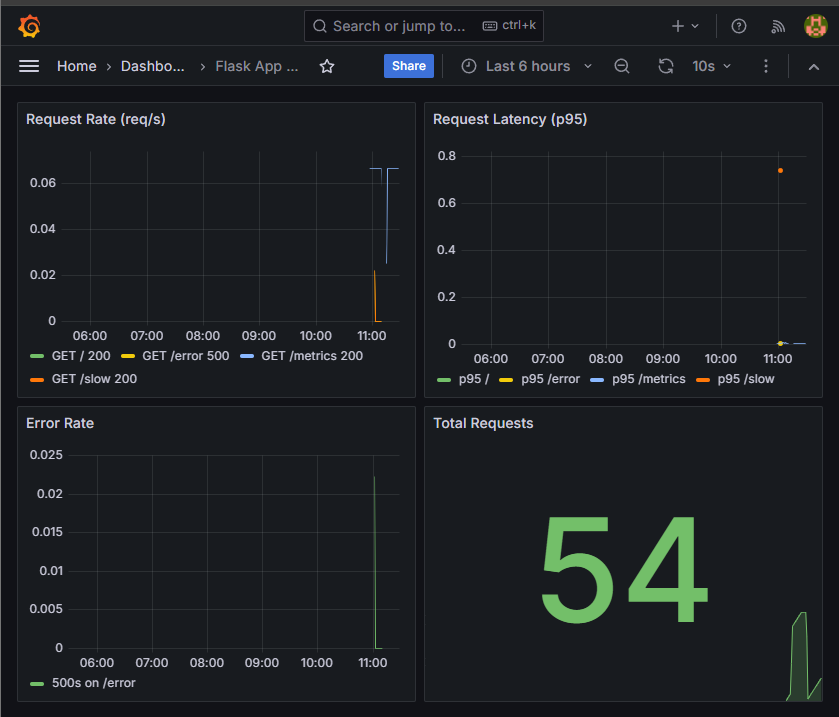

# Monitoring Stack — Prometheus, Grafana & Alertmanager

A self-contained observability stack that monitors a Python Flask application using **Prometheus** for metrics, **Grafana** for dashboards, and **Alertmanager** for alert routing — all orchestrated with a single `docker compose up`.

Built to demonstrate an end-to-end monitoring pipeline: instrument an app → scrape its metrics → visualize them → fire alerts when thresholds are breached.



---

## How It Works

```
                  scrape /metrics
   ┌────────────┐  ───────────────►  ┌──────────────┐  evaluates   ┌────────────────┐
   │ flask-app  │                    │  Prometheus  │  alert_rules │  Alertmanager  │
   │  :5000     │  ◄───────────────  │    :9090     │ ───────────► │     :9093      │
   └────────────┘                    └──────┬───────┘              └────────────────┘
                                            │ data source
                                            ▼
                                     ┌──────────────┐
                                     │   Grafana    │
                                     │    :3000     │
                                     └──────────────┘
```

1. The **Flask app** exposes application metrics at `/metrics`.
2. **Prometheus** scrapes that endpoint on an interval and stores the time-series data (7-day retention).
3. Prometheus evaluates the rules in `alert_rules.yml`; when a condition fires, it pushes the alert to **Alertmanager**, which handles routing.
4. **Grafana** queries Prometheus as a data source and renders the dashboards, which are auto-provisioned on startup.

All four services run on a shared `monitoring` Docker bridge network so they can reach each other by container name.

---

## Tech Stack

| Component | Image / Version | Purpose |
|-----------|----------------|---------|
| Flask app | Built from `./app` | Sample service instrumented with Prometheus metrics |
| Prometheus | `prom/prometheus:v2.51.2` | Metrics collection, storage, and alert evaluation |
| Alertmanager | `prom/alertmanager:v0.27.0` | Alert routing and notification |
| Grafana | `grafana/grafana:10.4.2` | Dashboards and visualization |
| Orchestration | Docker Compose | Local multi-container deployment |
| CI | GitHub Actions | Config validation on every push |

---

## Project Structure

```
monitoring-stack/
├── app/                      # Flask application + Dockerfile
├── prometheus/
│   ├── prometheus.yml        # Scrape config + Alertmanager target
│   └── alert_rules.yml       # Alerting rules evaluated by Prometheus
├── alertmanager/
│   └── alertmanager.yml      # Alert routing configuration
├── grafana/
│   ├── provisioning/         # Auto-provisioned data sources & dashboard config
│   └── dashboards/           # Dashboard JSON definitions
├── docs/
│   └── grafana-dashboard.png # Dashboard screenshot
├── .github/workflows/        # CI pipeline
└── docker-compose.yml
```

---

## Quickstart

**Prerequisites:** Docker and Docker Compose installed.

```bash
# Clone the repo
git clone https://github.com/Triple-S-Sajjad/monitoring-stack.git
cd monitoring-stack

# Build and start the full stack
docker compose up -d --build

# Confirm all four services are running
docker compose ps
```

That's it — the stack is live.

---

## Accessing the Services

| Service | URL | Notes |
|---------|-----|-------|
| Flask app | http://localhost:5000 | Application itself |
| Flask metrics | http://localhost:5000/metrics | Raw Prometheus metrics |
| Prometheus | http://localhost:9090 | Query metrics, check targets & alerts |
| Alertmanager | http://localhost:9093 | View firing/silenced alerts |
| Grafana | http://localhost:3000 | Dashboards — login `admin` / `admin` |

**Useful checks once it's running:**
- Prometheus targets: http://localhost:9090/targets (the Flask app should show as `UP`)
- Prometheus alerts: http://localhost:9090/alerts
- Generate some traffic against the Flask app, then watch the metrics move in Grafana.

---

## What's Monitored

The Flask app is instrumented to expose application metrics (request count, request latency, and error rates) at `/metrics`. Prometheus scrapes these and makes them queryable via PromQL, and the provisioned Grafana dashboard visualizes them out of the box.

Alerting rules live in `prometheus/alert_rules.yml` and are evaluated continuously by Prometheus; any that fire are forwarded to Alertmanager for routing.

---

## Stopping & Cleaning Up

```bash
# Stop the stack (keeps data volumes)
docker compose down

# Stop and remove volumes (wipes Prometheus & Grafana data)
docker compose down -v
```

---

## Notes & Production Considerations

This stack is configured for **local development and demonstration**. Before anything like this went to production, the following would need to change:

- **Credentials:** Grafana uses `admin` / `admin` via environment variables. In a real deployment these would come from a secrets manager, not be committed to the repo.
- **Persistence & retention:** Prometheus retention is set to 7 days with a local volume. Production setups typically use longer retention and remote storage (e.g. Thanos, Cortex, or managed Prometheus).
- **Alert delivery:** Alertmanager is wired up but routes would need real receivers (Slack, PagerDuty, email) configured for actual on-call.
- **TLS / access control:** All services are exposed over plain HTTP on localhost. A production deployment would sit behind TLS and authentication.

---

## Roadmap / Possible Extensions

- [ ] Add `node_exporter` to capture host-level metrics (CPU, memory, disk)
- [ ] Add `cAdvisor` for per-container resource metrics
- [ ] Wire Alertmanager to a real Slack/email receiver
- [ ] Deploy the stack to Kubernetes via the Prometheus Operator / kube-prometheus-stack
- [ ] Add a load-generation script to demonstrate alerts firing under stress
